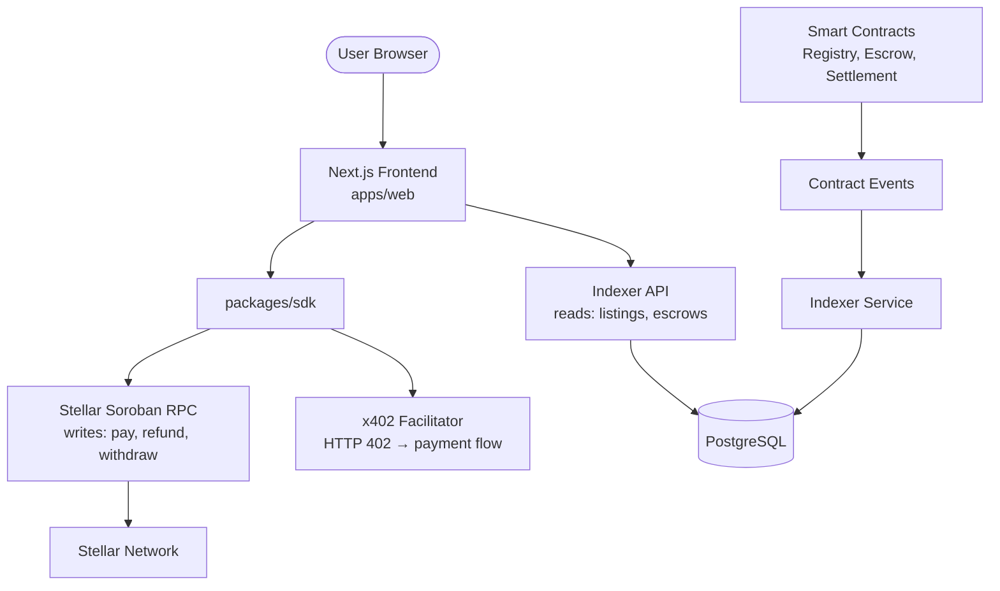

# x402 LLM-Utility Marketplace

[](LICENSE)


[](https://drips.network/wave/stellar)

**Pay-per-call LLM utility APIs — token counting, embeddings, moderation, document parsing — with Soroban escrow payments, automatic refunds on failure, and a 2% protocol fee.**

Built using the [Stellar Wave Builder](https://drips.network/wave/stellar) process: research-driven idea validation, contract-first architecture, and a phased build from ecosystem reconnaissance through on-chain deployment and program submission.

## Project Status

| Phase | Status |
|-------|--------|
| 1 — Ecosystem Reconnaissance | Done |
| 2 — Idea Generation | Done |
| 3 — Critical Review | Done |
| 4 — Naming & Scoping | Done |
| 5 — Contract Architecture | Done |
| 6 — Contract Implementation | Done |
| 7 — App Layer | In Progress |
| 8 — Local Environment & Deployment | Pending |
| 9 — Hosting & Service Topology | Pending |
| 10 — Repo Hygiene for Program Approval | Pending |
| 11 — Documentation Site | Pending |
| 12 — Drips Wave Submission | Pending |

## Architecture

### Repository Structure

```
x402-llm-utils/
├── contracts/          # Soroban smart contracts (Rust workspace)
│   ├── shared/         #  — Shared types, errors, storage structs
│   ├── registry/       #  — API listing registry (create, price, pause)
│   ├── escrow/         #  — Payment escrow (lock, confirm, refund, withdraw)
│   └── settlement/     #  — Batch settlement (skeleton)
├── packages/
│   └── sdk/            # TypeScript SDK — Soroban RPC bindings + x402 handler
├── apps/
│   └── web/            # Next.js frontend
└── indexer/            # PostgreSQL event indexer
```

### Service Topology



### Contract Dependencies (deploy order)

```
Registry  ←──  Escrow  ←──  Settlement
                     ↘───────────────↗
```

- **Registry** — No contract dependencies. Deployed first.
- **Escrow** — Depends on Registry address (validates `api_id` exists). Deployed second.
- **Settlement** — Depends on Escrow address (for batch payout data). Deployed third.

## Architecture
- **x402-llm-utils-contract**: Pure Rust/Soroban workspace (`registry`, `escrow`, `settlement`, `shared`).
- **x402-llm-utils-app**: Monorepo containing `packages/sdk`, `apps/web`, and `indexer/`.

## Locked Design Choices
- **Vertical Lock**: LLM-utility APIs only.
- **Verification Model**: Lightweight verifier call for `confirm_execution()` (response within timeout, correct HTTP status, non-empty payload matching schema). Self-attestation is explicitly rejected.
- **Platform Fee**: Fixed at 2%, collected on withdrawal in Escrow.

## License

Apache-2.0
